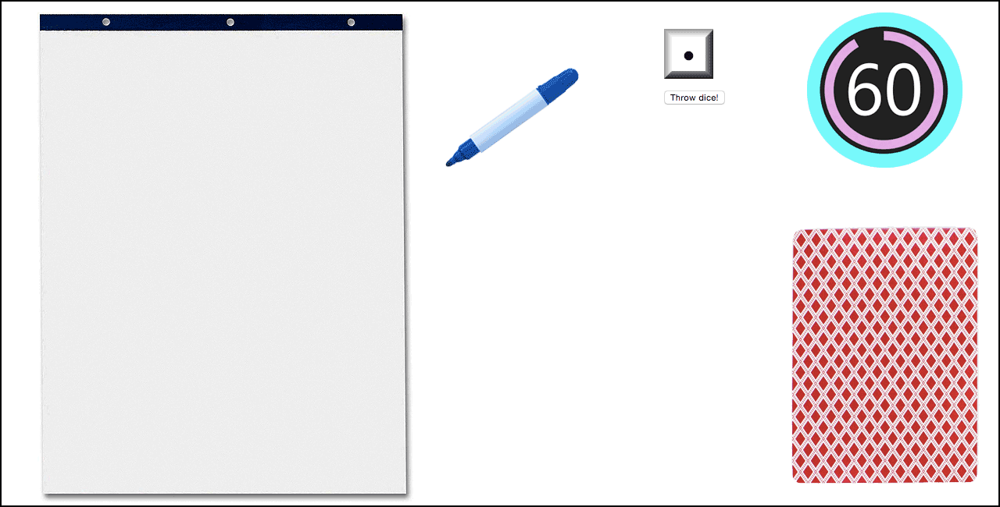

<h1>PICTIONARY (WORKING TITLE)</h1>

A two team (minimum three players total) drawing charades game.

<h1>INTRODUCTION</h1>

This online version of pictionary can be played with three or more people.

The game includes a board, 4 playing pieces and category cards, a 1-minute timer and a die. 

While the game is in play, there is also an online drawing pad and pen.

<h1>RULES</h1>

It's against the rules to communicate with teammates other than drawing clues. The player who is drawing also cannot use numbers, letters or the "#" symbol in drawings.
 

<h1>STEPS</h1>

**STEP 1:**
Divide players into 2 teams. If you only have 3 players, 1 person must be designated to draw for both teams during the entire game.

**STEP 2:**
Roll dice to see which team starts

**STEP 3:**
First team draws a category card. The category card shows what the letters of each category on the playing board and word cards means. The different categories are (P) for person, place or animal; (O) for object; (A) for action, such as an event; and (D) for difficult words. The game starts on the letter (P) and each team will start on the first square whch is a (P) person, place or animal.

**STEP 4:**
All the players on the first team except for the drawer, look away from the screen. The drawer clicks or mousesover on the card and it reveals the word that they will draw. On click or mouseout, the word is hidden again.

**STEP 5:**
The drawer starts the timer by clicking on it and it counts down from 60 seconds. The drawer begins drawing on the online drawing pad with their mouse or trackpad.
 
Teammates can guess continuously during the 1-minute drawing time. They would do this by typing in their guessed answer. 

**STEP 6:**
If teammates guess the word on the card before the timer runs out, they get to roll the die, pick another card and draw again.

If teammates don't guess the word in time, then it is the second team's turn. Second team begins by drawing a word card.

Start each turn by picking a word card, not rolling the die. You only get to roll the die and move the playing piece when your team guesses the word before the timer runs out and your turn continues.

**STEP 7:**
Continue to play Pictionary until a team reaches the final all play square on the game board. (You don't have to land on this square with an exact roll of the die.) If your team doesn't guess the word, play continues with the other teams turn.

<h1>MVP - Minimal Viable Product</h1>

At the minimum, the game will have these elements and steps:

This drawing charades game can be played with three or more people.

The game includes category cards, a 1-minute timer and a die. 

No gameboard in this version!

While the game is in play, there is also an online drawing pad and pen.

**STEP 1:**
Divide players into 2 teams. If you only have 3 players, 1 person must be designated to draw for both teams during the entire game.

**STEP 2:**
Roll dice to see which team starts

**STEP 3:**
The first team draws a card or makes a selection which will return the category. The categories are (P) for person, place or animal; (O) for object; (A) for action, such as an event; and (D) for difficult words.  

**STEP 4:**
All the players on the first team except for the drawer, look away from the screen. The drawer clicks or mousesover on the card and it reveals the word that they will draw. On click or mouseout, the word is hidden again.

**STEP 5:**
The drawer starts the timer by clicking on it and it counts down from 60 seconds. The drawer begins drawing on the online drawing pad with their mouse or trackpad.
 
Teammates can guess continuously during the 1-minute drawing time. They would do this by typing in their guessed answer.

**STEP 6:**
If teammates guess the word on the card before the timer runs out, they get to roll the die, pick another card and draw again.

If teammates don't guess the word in time, then it is the second team's turn. Second team begins by drawing a word card.

Start each turn by picking a word card.

**STEP 7:**
Winner is the first to reach three wins.

If your team doesn't guess the word, play continues with the other team's turn.

<h1>TECHNOLOGY</h1>

•CANVAS

<h1>WIREFRAME LOOK AND FEEL</h1>

<h1>USER STORIES</h1>

As a player, when I play I want to be able to guess the right answer and feel smart.